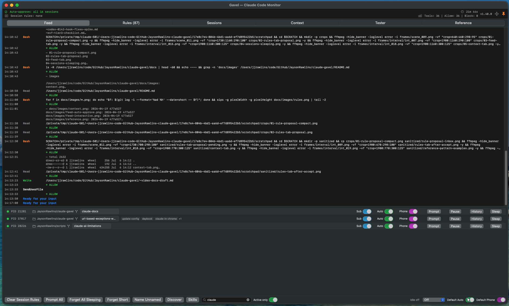
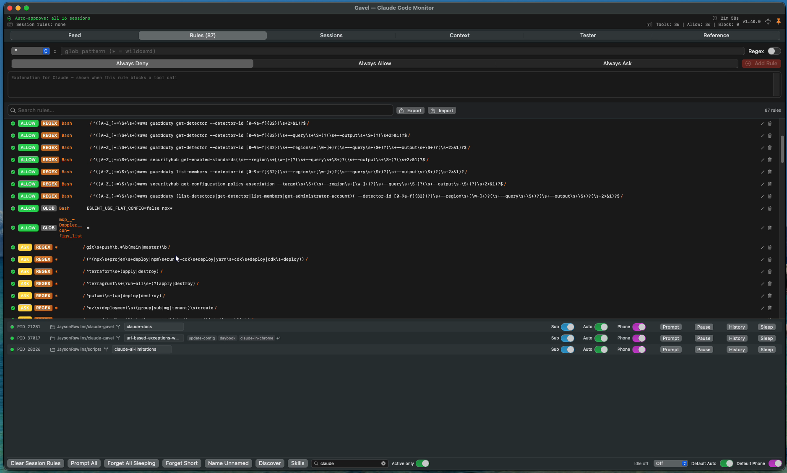
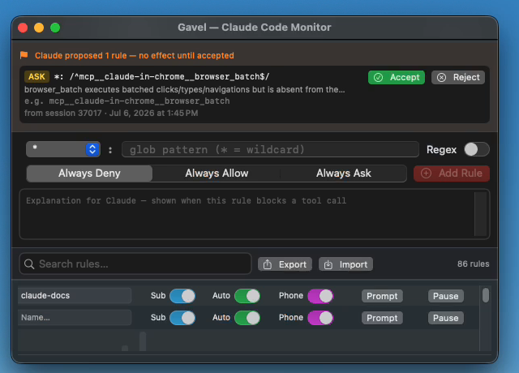
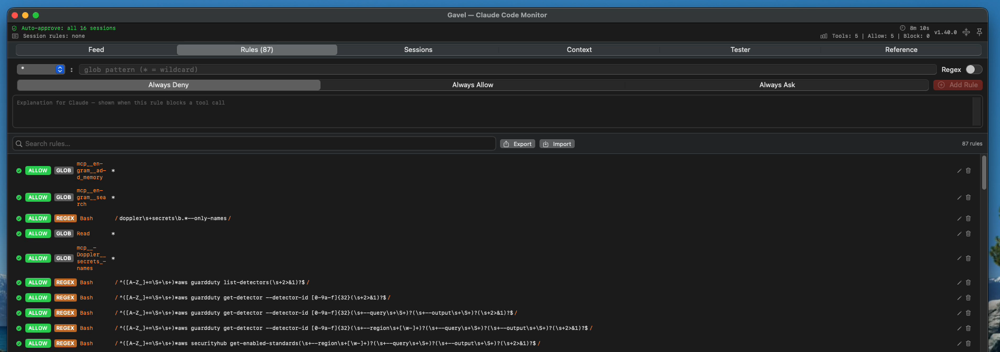
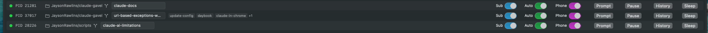
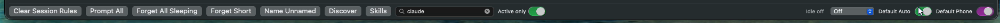
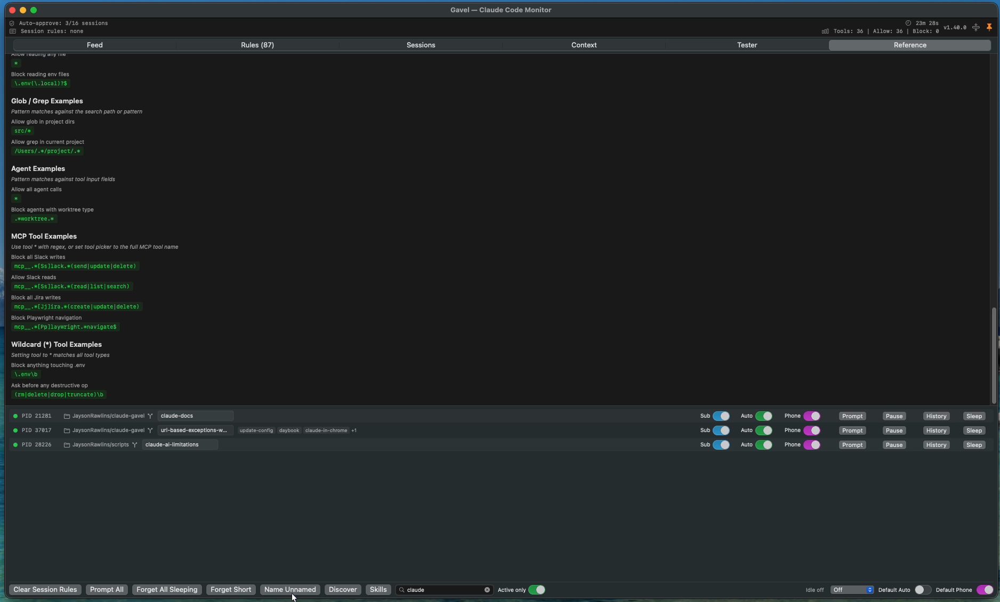

# Gavel

Native macOS menu bar daemon for [Claude Code](https://docs.anthropic.com/en/docs/claude-code) and [OpenAI Codex CLI](https://developers.openai.com/codex/cli) session monitoring and approval.

Gavel intercepts every tool call your agent makes — file edits, shell commands, MCP calls — and routes them through a configurable approval engine before they execute. You see what's happening, control what's allowed, and block what isn't.



## Install

```bash
brew tap JaysonRawlins/gavel
brew install gavel
gavel-setup
brew services start gavel
```

<details>
<summary>Install from source</summary>

```bash
git clone https://github.com/JaysonRawlins/claude-gavel.git
cd claude-gavel
./install.sh
```
</details>

## How It Works

Gavel runs as a menu bar app. Claude Code's hook system sends every tool call to gavel through a Unix socket. The approval engine evaluates it against a 9-stage priority chain and either allows it, blocks it, or pops up an interactive dialog.

```
Claude Code → hook shim → gavel-hook (CLI) → Unix socket → gavel daemon
                                                              │
                                                    ┌─────────┴──────────┐
                                                    │  Approval Engine   │
                                                    │  (9-stage chain)   │
                                                    └─────────┬──────────┘
                                                              │
                                              ┌───────┬───────┼───────┐
                                            allow   block   prompt  modify
                                              │       │       │       │
                                              └───────┴───────┴───────┘
                                                              │
                                                   response → Claude Code
```

### Approval Priority Chain

Deny always wins. Each stage is evaluated in order — first match decides.

| Stage | Rule | Overridable? |
|-------|------|-------------|
| 1 | Dangerous patterns (reverse shells, credential exfil) | No |
| 2 | Persistent DENY rules | No |
| 3 | Session pause | No |
| 4 | User PROMPT rules | No (beats allow) |
| 5 | Sensitive paths (gavel config, hooks, shell config) | No (beats allow) |
| 6 | Persistent ALLOW rules | — |
| 7 | Built-in PROMPT rules (MCP exfil defaults) | Yes (allow overrides) |
| 8 | Timed auto-approve | — |
| 9 | Interactive approval dialog | — |

### Built-in Protections

Gavel ships with 12 seeded rules that prompt before potentially dangerous operations:

- Slack, email, webhook write operations
- Playwright browser interaction
- HTTP write methods via MCP
- Inline script execution (`python -c`, `ruby -e`, `node -e`)
- `osascript` and `open -a` (sandbox escape vectors)
- `curl file://` (local file read bypass)
- Destructive git operations (`reset --hard`, `checkout --`, `clean -fd`)
- Push to `main`/`master`
- Any command referencing `.claude/` config paths

These are visible and editable in the Rules tab. You can override them with allow rules or add your own.



## Rule Proposals

Claude can propose new guardrails from inside a session with `gavel-hook propose-rule` — for example after noticing a dangerous pattern that sailed through, or a denial that generalizes. Proposals are **inert until you accept them**. They land in an inbox banner at the top of the Rules tab:



Each proposal shows the verdict badge, tool and pattern, Claude's stated reason, an example command that would match, and which session proposed it and when. **Accept** compiles it into the live rule set; **Reject** discards it. Proposals are tighten-only — `allow` proposals are rejected server-side — and accepted rules are appended to the hash-chained audit journal (`rules.audit.jsonl`) like any manual edit.



## Interactive Approval Panel

When a tool call needs approval, a floating panel appears showing:

- **Tool name** and full command or file path
- **Editable command** — modify the command before allowing
- **Pattern field** — pre-filled glob pattern for creating rules

Actions (keyboard shortcuts):

| Action | Key | Scope |
|--------|-----|-------|
| Allow once | Enter | This call only |
| Deny with note | Esc | This call, sends feedback to Claude |
| Session Allow | Cmd+S | Pattern-matched for this session |
| Session Deny | Cmd+D | Pattern-matched for this session |
| Always Allow | Cmd+Shift+A | Persistent rule |
| Always Deny | Cmd+Shift+D | Persistent rule |
| Always Prompt | Cmd+Shift+P | Persistent rule |

Each Claude Code session gets its own approval panel — parallel sessions don't block each other.

## Monitor Window

Click the menu bar icon to open the monitor. Six tabs:

- **Feed** — live stream of hook events with timestamps and decisions, plus command output previews, session lifecycle events, and a `Ready for your input` marker when a session goes idle
- **Rules** — searchable list of persistent rules with inline editing, import/export, glob/regex badges
- **Sessions** — per-session state: active rules, stats, tainted paths, auto-approve status
- **Context** — edit the session context injected into every Claude Code session
- **Tester** — interactive regex/glob pattern tester with match highlighting
- **Reference** — regex syntax cheat sheet and copy-ready rule-pattern examples per tool family

The header strip shows the approval mode at a glance — `Auto-approve: all N sessions`, `Auto-approve: N/M sessions`, or `Interactive approval` — alongside live tool/allow/block counters and daemon uptime.

### Menu Bar Icon

- **Default** (monochrome) — interactive mode, every tool call prompts
- **Green** — default auto-approve is on (deny rules and sensitive paths still force dialogs)

| Auto-approve on | Interactive mode |
|:---:|:---:|
|  |  |

### Rules


### Sessions


### Session rows

Every tab keeps a session strip docked at the bottom. Each live session shows its PID, repo and branch, an editable name (auto-named from the first prompt), skill tags observed during the session, and per-session toggles — **Sub** (sub-agent inherit), **Auto** (auto-approve), **Phone** (remote approval via Telegram) — plus **Prompt**, **Pause**, **History** (transcript viewer), and **Sleep** buttons.



Slept and exited sessions remain as tombstones with **History**, **Resume** (copies a resume command), and **Forget**. The bottom bar holds bulk operations, a session filter, and the defaults for new sessions:



## Session Context

Gavel injects `~/.claude/gavel/session-context.md` into every Claude Code session at startup. This seeds Claude with engineering principles, code quality standards, and verification practices.

Edit it from the menu bar (Edit Session Context) or the Context tab. The file is plain markdown — add your own instructions, project conventions, or team standards.


## Configuration

All config lives in `~/.claude/gavel/`:

| File | Purpose |
|------|---------|
| `rules.json` | Persistent approval rules (deny/allow/prompt). Created on first run with seeded defaults. |
| `session-context.md` | Injected into every session. Editable via UI or any text editor. |
| `session-defaults.json` | Default auto-approve, sub-agent inherit, and pause state for new sessions. |
| `gavel.log` | Daemon log with crash traces and signal handlers. |
| `gavel.sock` | Unix domain socket (runtime). |

### Rules

Rules support **glob** (`swift build*`, `*/production.yml`) and **regex** (`doppler\s+secrets\b(?!.*--only-names)`) patterns. Each rule has:

- **Tool**: which tool it applies to (`Bash`, `Edit`, `Read`, `*` for all)
- **Pattern**: glob or regex matched against the command or file path
- **Verdict**: deny, allow, or prompt
- **Explanation** (deny only): feedback shown to Claude when blocked

Import/export rules as JSON from the Rules tab.

### Pattern Tester

Test glob and regex patterns interactively before creating rules.


The Reference tab pairs a regex cheat sheet with copy-ready rule-pattern examples for each tool family — file tools, Glob/Grep, Agent, MCP tools (block Slack/Jira writes while allowing reads, block Playwright navigation), and wildcard rules that match across all tools.




## Security

### Taint Tracking

Gavel tracks sensitive data flow across tool calls. If Claude copies SSH keys or credentials to a temp file, then tries to exfiltrate via `curl` or MCP tools, gavel blocks the second step even if the individual commands look benign.

### Self-Protection

Gavel protects its own config files and Claude Code's hook configuration. Commands that read or modify `.claude/gavel/`, `.claude/settings.json`, or `.claude/hooks/` trigger an interactive dialog regardless of auto-approve state or allow rules.

### Fail Behavior

- **Daemon unreachable**: fail open (allow) — Claude Code works without gavel
- **Daemon reachable, bad response**: fail closed (block) — prevents silent bypass
- **Hook shim missing**: graceful degradation, no crash

## Architecture

- **Language**: Swift (zero external dependencies)
- **UI**: AppKit (menu bar, window management) + SwiftUI (all views)
- **IPC**: Unix domain socket at `~/.claude/gavel/gavel.sock`
- **Platform**: macOS 13+
- **Binaries**: `gavel` (daemon, ~1MB) and `gavel-hook` (CLI shim, ~85KB, ~6ms overhead per hook)
- **Tests**: 282 tests across 6 suites

## Using Gavel with Codex CLI

Gavel works with [OpenAI Codex CLI](https://developers.openai.com/codex/cli) in addition to Claude Code. The same approval daemon, rules, and monitor handle both — Codex's `apply_patch`, shell exec, and MCP calls all route through `gavel-hook` to the policy engine. Codex invokes `gavel-hook` directly (no bash shim), so the per-call overhead is the same ~6ms as Claude.

### Auto-setup via install.sh

If `codex` is in `PATH` when you run `./install.sh`, the installer appends a `[[hooks.PreToolUse]]` block to `~/.codex/config.toml` pointing at the installed `gavel-hook`. Re-running is idempotent. `./install.sh --uninstall` removes the block.

### Manual setup (brew users, or any time)

Add to `~/.codex/config.toml`:

```toml
[[hooks.PreToolUse]]
matcher = ".*"

[[hooks.PreToolUse.hooks]]
type = "command"
command = "/opt/homebrew/bin/gavel-hook"
timeout = 600
```

### One-time trust enrollment

Codex requires explicit user trust for any new hook command. After registering:

1. Run `codex` interactively
2. Banner: `"1 hook needs review before it can run. Open /hooks to review it."`
3. Type `/hooks`, verify the entry is `gavel-hook`, trust it
4. Quit the TUI

From then on, every `codex exec` and interactive session routes tool calls through Gavel.

### Codex-specific protections

A seeded `apply_patch` rule (verdict: prompt) catches patches that write to:

- `~/.claude/gavel/`, `~/.claude/settings`, `~/.claude/hooks/`
- `~/.codex/config`, `~/.codex/hooks`
- Shell init files (`.zshrc`, `.bashrc`, `.bash_profile`, `.profile`)

This is defense-in-depth for the surface that shell-pattern Bash rules can't reach — Codex's `apply_patch` writes files without invoking `$SHELL`, so shell-level interceptors miss it.

### Session attribution

Codex sessions get their own row in the Monitor, distinct from any Claude Code session that may have launched them. The row is tagged with a small orange **Codex** badge so it's identifiable at a glance. The hook subprocess walks the process tree looking for the `codex` ancestor (parallel to the existing `claude` walk) whenever `gavel-hook` was invoked from Codex — detected via the `turn_id` field Codex includes in hook stdin but Claude doesn't. The envelope carries `agent: "codex"` so the daemon creates and persists a Codex-tagged session.

### Session context injection

Codex sessions get the same philosophy injection Claude sessions do — `~/.claude/gavel/session-context.md` is read at SessionStart and emitted as `additionalContext` in Codex's hookSpecificOutput shape, so the same engineering principles, user-interaction guidance, and personal tuning are loaded into Codex's model context on every session. One file, both agents.

## Uninstall

```bash
gavel-uninstall-hooks
brew services stop gavel
brew uninstall gavel
brew untap JaysonRawlins/gavel
```

Config files in `~/.claude/gavel/` are preserved. Delete manually if desired.

## License

MIT
